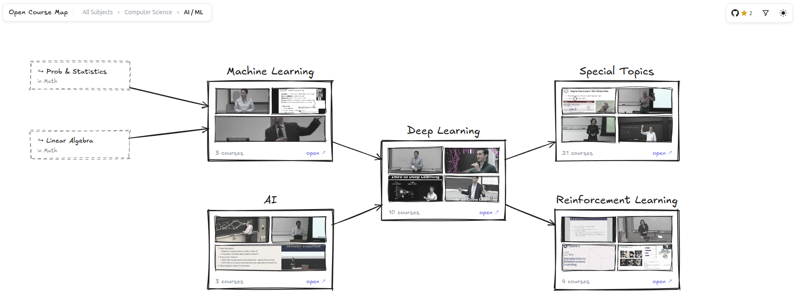

# open-course-map



A hand-drawn map of the best free university courses on the internet. MIT, Stanford, Yale, Harvard and more, organized by subject with prerequisite arrows so you know what to take next.

## Why

- The best courses ever taught are free on YouTube, but they're scattered across OCW sites and playlists
- Lists and spreadsheets are flat, they don't tell you what to take before what
- A map does. Pick a subject, see the courses, follow the arrows

## What's on it

- ~130 courses across math, physics, CS, and biology from 13 universities
- Every course links to its official page and lecture playlist
- Per-lecture YouTube view counts, so you can see how popular a course is and where people drop off
- Prerequisite edges within and across subjects

## Add a course

- All data is plain JSON in `src/data`
- `fields.json` is the atlas: subject groups and cross-subject edges
- Each `subjects/<id>.json` holds one subject's courses
- Add the course to the right subject file and open a PR

## Run locally

```
npm install
npm run dev
```

React + Vite + rough.js for the hand-drawn look.
